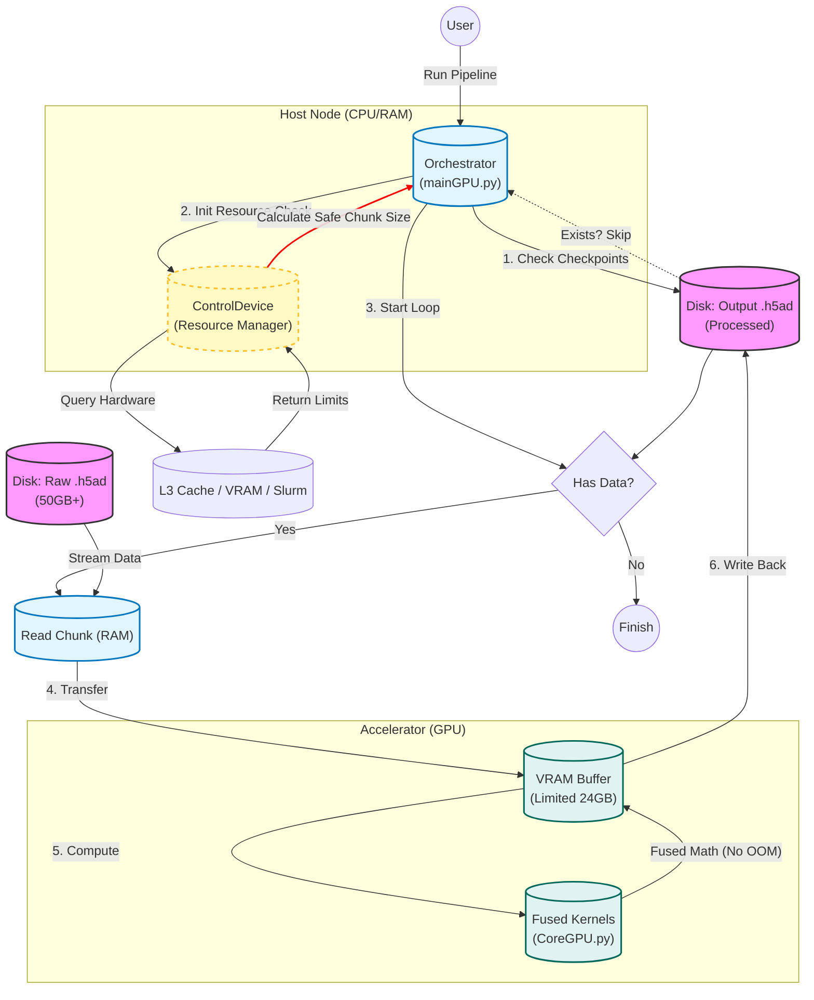

```mermaid
graph TD
    %% STYLING
    classDef storage fill:#f9f,stroke:#333,stroke-width:2px;
    classDef process fill:#e1f5fe,stroke:#0277bd,stroke-width:2px;
    classDef logic fill:#fff9c4,stroke:#fbc02d,stroke-width:2px,stroke-dasharray: 5 5;
    classDef gpu fill:#e0f2f1,stroke:#00695c,stroke-width:2px;

    %% NODES
    User((User))
    Disk_Raw[("Disk: Raw .h5ad\n(50GB+)")]:::storage
    Disk_Out[("Disk: Output .h5ad\n(Processed)")]:::storage

    subgraph "Host Node (CPU/RAM)"
        Main[("Orchestrator\n(mainGPU.py)")]:::process
        Control[("ControlDevice\n(Resource Manager)")]:::logic
    end

    subgraph "Accelerator (GPU)"
        Kernel[("Fused Kernels\n(CoreGPU.py)")]:::gpu
        VRAM[("VRAM Buffer\n(Limited 24GB)")]:::gpu
    end

    %% FLOW
    User -->|Run Pipeline| Main
    Main -->|1. Check Checkpoints| Disk_Out
    Disk_Out -.->|Exists? Skip| Main

    Main -->|2. Init Resource Check| Control
    Control -->|Query Hardware| SysInfo[("L3 Cache / VRAM / Slurm")]
    SysInfo -->|Return Limits| Control
    Control -->|Calculate Safe Chunk Size| Main

    %% THE LOOP
    Main -->|3. Start Loop| LoopStart{Has Data?}
    LoopStart -->|Yes| ReadChunk[("Read Chunk (RAM)")]:::process
    Disk_Raw -->|Stream Data| ReadChunk
    
    ReadChunk -->|4. Transfer| VRAM
    VRAM -->|5. Compute| Kernel
    Kernel -->|"Fused Math (No OOM)"| VRAM
    
    VRAM -->|6. Write Back| Disk_Out
    Disk_Out --> LoopStart
    LoopStart -->|No| End((Finish))

    %% ANNOTATIONS
    linkStyle 6 stroke:red,stroke-width:2px;
```
