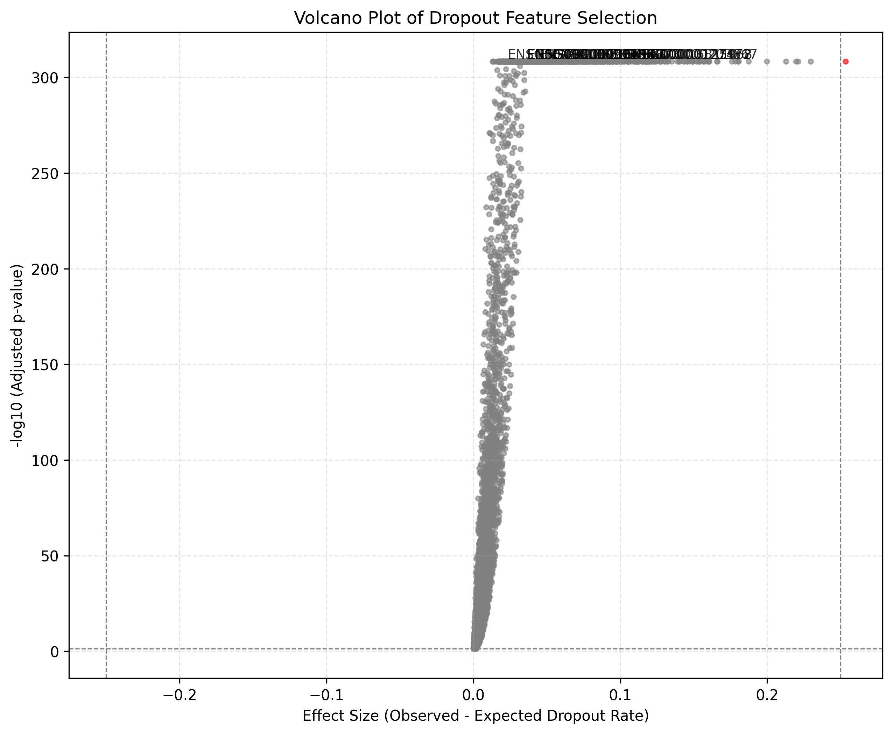

# Welcome to M3DropGPU tutorial!

## Core Pipeline - Human Heart

### 1. Setup

1.  **Test Data:**
    * Download the data from: [https://cellxgene.cziscience.com/collections/b52eb423-5d0d-4645-b217-e1c6d38b2e72](https://cellxgene.cziscience.com/collections/b52eb423-5d0d-4645-b217-e1c6d38b2e72) (Cells of the Human Heart by CZI Cell Science)
    * Download the file: **All — Cells of the adult human heart, 486,134 cells.**
    * Rename the downloaded `.h5ad` file to `Human Heart.h5ad`.

2.  **Installation and Your Project File Location:**
    * Install the package with 'pip install M3Drop' on your command prompt.
    * Create a new folder that contains your dataset, `Human Heart.h5ad`, and `tutorial_core_pipeline.py`.

3.  **Script Check:**
    * Open `tutorial_core_pipeline.py` and check that the `DATASET_BASENAME` variable is correctly set to the name of the dataset.
    * Ensure ROW_CHUNK is set appropriately to the available RAM of your hardware. If set too high, you will experience out of memory error.

    ```python
    DATASET_BASENAME = "Human_Heart"
    ROW_CHUNK = 5000
    ```

### 2. Execution

Run the script from your terminal.

### 3. Terminal Output

You should be able to see the following lines on your terminal.

```text
--- Initializing M3Drop+ Pipeline for Human Heart.h5ad ---

--- PIPELINE STAGE 1: DATA CLEANING ---
FUNCTION: ConvertDataSparse() | FILE: Human Heart.h5ad
Phase [1/2]: Identifying genes with non-zero counts...
Phase [1/2]: COMPLETE | Result: 31222 / 33145 genes retained.
Phase [2/2]: Rounding up decimals and saving filtered output to disk...
Phase [2/2]: COMPLETE | Output: Human Heart_cleaned.h5ad
Total time: 76.85 seconds.

--- PIPELINE STAGE 2: STATISTICS CALCULATION ---
FUNCTION: hidden_calc_vals() | FILE: Human Heart_cleaned.h5ad
Phase [1/3]: Finding nc and ng...
Phase [1/3]: COMPLETE
Phase [2/3]: Calculating tis and tjs...
Phase [2/3]: COMPLETE
Phase [3/3]: Calculating dis, djs, and total...
Phase [3/3]: COMPLETE
Total time: 18.30 seconds.

STATUS: Saving statistics to 'Human Heart_stats.pkl'...
STATUS: COMPLETE

--- PIPELINE STAGE 3: MODEL FITTING ---
FUNCTION: NBumiFitModel() | FILE: Human Heart_cleaned.h5ad
Phase [1/3]: Pre-calculating sum of squared expectations...
Phase [1/3]: COMPLETE
Phase [2/3]: Calculating variance components from data chunks...
Phase [2/3]: COMPLETE
Phase [3/3]: Finalizing dispersion and variance calculations...
Phase [3/3]: COMPLETE
Total time: 17.62 seconds.

STATUS: Saving fit results to 'Human Heart_fit.pkl'...
STATUS: COMPLETE

--- PIPELINE STAGE 4: FEATURE SELECTION ---

--- Method 1: High Variance ---
FUNCTION: NBumiFeatureSelectionHighVar()
Phase [1/1]: Calculating residuals for high variance selection...
Phase [1/1]: COMPLETE
Total time: 0.0293 seconds.

STATUS: Saving high variance genes to 'Human Heart_high_variance_genes.csv'...
STATUS: COMPLETE

--- Method 2: Combined Dropout ---
FUNCTION: NBumiFeatureSelectionCombinedDrop() | FILE: Human Heart_cleaned.h5ad
Phase [1/3]: Initializing arrays and calculating expected dispersion...
Phase [1/3]: COMPLETE
Phase [2/3]: Calculating expected dropout sums from data chunks...
Phase [2/3]: COMPLETE
Phase [3/3]: Performing statistical test and adjusting p-values...
Phase [3/3]: COMPLETE
Total time: 21.38 seconds.

STATUS: Saving combined dropout genes to 'Human Heart_combined_dropout_genes.csv'...
STATUS: COMPLETE

--- PIPELINE STAGE 5: VISUALIZATION ---
FUNCTION: NBumiCombinedDropVolcano()
Phase [1/1]: Preparing data for visualization...
Phase [1/1]: COMPLETE
Phase [2/2]: Generating plot...
STATUS: Volcano plot saved to 'Human Heart_volcano_plot.png'
Phase [2/2]: COMPLETE
Total time: 0.82 seconds.

--- M3Drop+ Pipeline Complete ---
Total execution time: 2.26 minutes.
```

### 4. Pipeline Results

#### High Variance Genes (`Human Heart_high_variance_genes.csv`)

This file ranks all genes by their residual, or how much more variable they are than expected. Here are the top 10 most variable genes:

```csv
Gene,Residual
20083,RPL13A,0.3060413009941165
19864,RGS5,0.3015505705307301
20088,RPL14,0.2989182064560737
20078,RPL12,0.2952865983790518
20131,RPL23A,0.2891398863673528
20152,RPL27A,0.2844781442129598
20163,RPL29,0.2844287893967885
20102,RPL18,0.2762391039864223
20202,RPL37,0.2748897584617637
20146,RPL27,0.27375217822949024
...
```

#### Combined Dropout Genes (`Human Heart_combined_dropout_genes.csv`)

This file lists the genes with a significantly higher dropout rate than expected, sorted by significance. Here are the top 10 most significant genes:

```csv
Gene,effect_size,p.value,q.value
31219,MT-ND4,0.013745230919245037,0.0,0.0
31214,MT-CYB,0.009139860292316885,0.0,0.0
31218,MT-ND3,0.003507011984218886,0.0,0.0
31212,MT-CO3,0.00841261350915661,0.0,0.0
31211,MT-CO2,0.007530661138870144,0.0,0.0
31221,MT-ND6,0.003975003649479373,0.0,0.0
31210,MT-CO1,0.007052945768565259,0.0,0.0
31216,MT-ND1,0.006122601736780777,0.0,0.0
31217,MT-ND2,0.006455112521118678,0.0,0.0
31220,MT-ND5,0.004456631853177695,0.0,0.0
...
```

#### Volcano Plot (`Human Heart_volcano_plot.png`)

#### Volcano Plot (`Human Heart_volcano_plot.png`)

This plot visualizes the "Combined Dropout" results. Observations (Genes) in red are statistically significant.



## Diagnostic Pipeline - Human Heart

### 1. Setup

1.  **Test Data:**
    * Download the data from: [https://cellxgene.cziscience.com/collections/b52eb423-5d0d-4645-b217-e1c6d38b2e72](https://cellxgene.cziscience.com/collections/b52eb423-5d0d-4645-b217-e1c6d38b2e72) (Cells of the Human Heart by CZI Cell Science)
    * Download the file: **All — Cells of the adult human heart, 486,134 cells.**
    * Rename the downloaded `.h5ad` file to `Human Heart.h5ad`.

2.  **Installation and Your Project File Location:**
    * Install the package with 'pip install M3Drop' on your command prompt.
    * Create a new folder that contains your dataset, `Human Heart.h5ad`, and `tutorial_core_pipeline.py`.

3.  **Script Check:**
    * Open `tutorial_core_pipeline.py` and check that the `DATASET_BASENAME` variable is correctly set to the name of the dataset.
    * Ensure ROW_CHUNK is set appropriately to the available RAM of your hardware. If set too high, you will experience out of memory error.

    ```python
    DATASET_BASENAME = "Human_Heart"
    ROW_CHUNK = 5000
    ```

### 2. Execution

Run the script from your terminal.

### 3. Terminal Output

You should be able to see the following lines on your terminal.

```text
--- Initializing M3Drop+ Diagnostic Pipeline for Human Heart.h5ad ---

--- PIPELINE STAGE 1: DATA CLEANING ---
FUNCTION: ConvertDataSparse() | FILE: Human Heart.h5ad
Phase [1/2]: Identifying genes with non-zero counts...
Phase [1/2]: COMPLETE | Result: 31222 / 33145 genes retained.
Phase [2/2]: Rounding up decimals and saving filtered output to disk...
Phase [2/2]: COMPLETE | Output: Human Heart_cleaned.h5ad
Total time: 89.55 seconds.

--- PIPELINE STAGE 2: STATISTICS CALCULATION ---
FUNCTION: hidden_calc_vals() | FILE: Human Heart_cleaned.h5ad
Phase [1/3]: Finding nc and ng...
Phase [1/3]: COMPLETE
Phase [2/3]: Calculating tis and tjs...
Phase [2/3]: COMPLETE
Phase [3/3]: Calculating dis, djs, and total...
Phase [3/3]: COMPLETE
Total time: 18.66 seconds.

STATUS: Saving statistics to 'Human Heart_stats.pkl'...
STATUS: COMPLETE

--- PIPELINE STAGE 3: ADJUSTED MODEL FITTING ---
FUNCTION: NBumiFitModel() | FILE: Human Heart_cleaned.h5ad
Phase [1/3]: Pre-calculating sum of squared expectations...
Phase [1/3]: COMPLETE
Phase [2/3]: Calculating variance components from data chunks...
Phase [2/3]: COMPLETE
Phase [3/3]: Finalizing dispersion and variance calculations...
Phase [3/3]: COMPLETE
Total time: 19.57 seconds.

STATUS: Saving adjusted fit to 'Human Heart_adjusted_fit.pkl'...
STATUS: COMPLETE

--- PIPELINE STAGE 4: DISPERSION VS. MEAN PLOT ---
FUNCTION: NBumiPlotDispVsMean()
STATUS: Diagnostic plot saved to 'Human Heart_disp_vs_mean.png'
FUNCTION: NBumiPlotDispVsMean() COMPLETE

--- PIPELINE STAGE 5: MODEL COMPARISON ---
FUNCTION: NBumiCompareModels() | Comparing models for Human Heart_cleaned.h5ad
Phase [1/4]: Creating temporary 'basic' normalized data file...
Phase [1/4]: COMPLETE
Phase [2/4]: Fitting Basic Model on normalized data...
FUNCTION: hidden_calc_vals() | FILE: Human Heart_cleaned_basic_norm.h5ad
...
Total time: 19.77 seconds.

FUNCTION: NBumiFitBasicModel() | FILE: Human Heart_cleaned_basic_norm.h5ad
...
Total time: 20.39 seconds.

Phase [2/4]: COMPLETE
Phase [3/4]: Evaluating fits of both models on ORIGINAL data...
FUNCTION: NBumiCheckFitFS() | FILE: Human Heart_cleaned.h5ad
...
Total time: 20.68 seconds.

FUNCTION: NBumiCheckFitFS() | FILE: Human Heart_cleaned.h5ad
...
Total time: 20.25 seconds.

Phase [3/4]: COMPLETE
Phase [4/4]: Generating final comparison...
STATUS: Model comparison plot saved to 'Human Heart_NBumiCompareModels.png'
Phase [4/4]: COMPLETE
STATUS: Temporary file 'Human Heart_cleaned_basic_norm.h5ad' removed.
Total time: 120.19 seconds.

--- Diagnostic Pipeline Complete ---
Total execution time: 4.16 minutes.
```

### 4. Pipeline Results

#### Dispersion vs. Mean Plot (`Human Heart_disp_vs_mean.png`)

This plot shows the log-log relationship between mean gene expression (x-axis) and the calculated dispersion parameter (y-axis). The red line indicates the regression fit used to smooth the dispersion values.


#### Model Comparison Plot (`Human Heart_NBumiCompareModels.png`)

This plot compares the observed dropout rate (black dots) against the expected dropout rates from the simple "Basic Fit" (purple) and the "Depth-Adjusted Fit" (gold). This visualization confirms that the Depth-Adjusted model provides a much better fit to the observed data.


